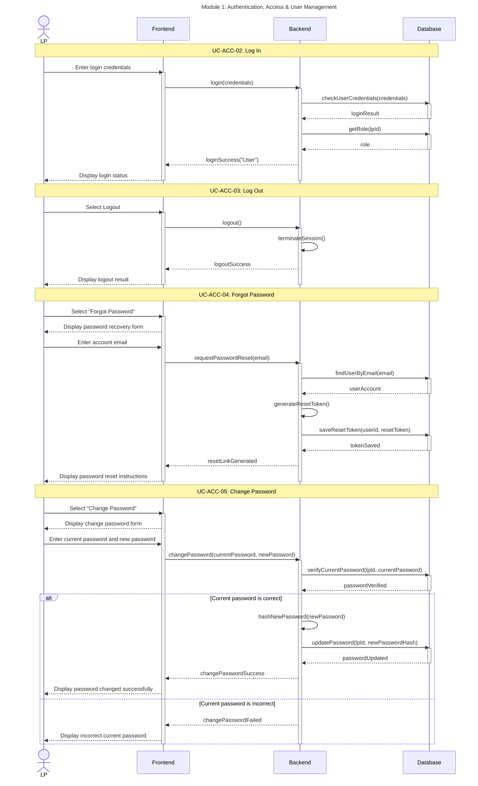
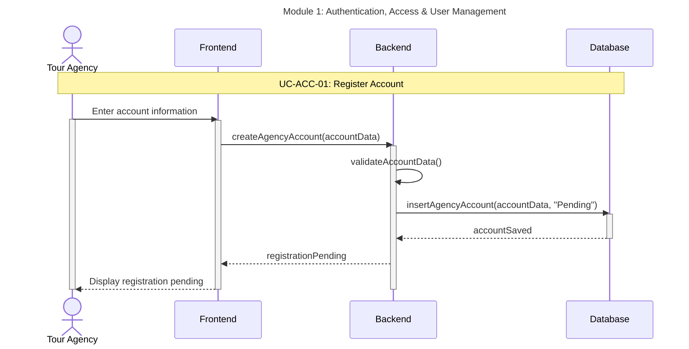
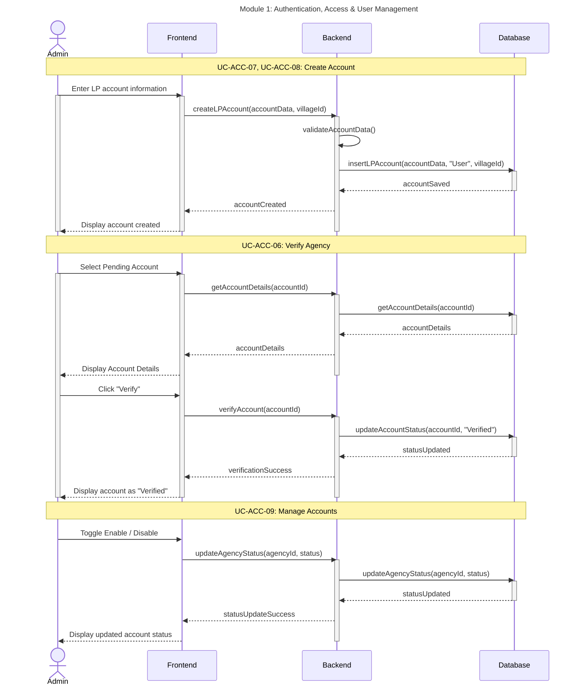
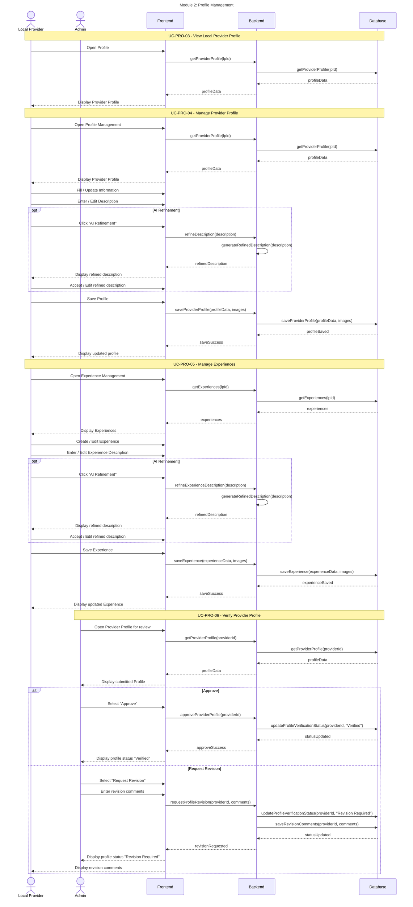
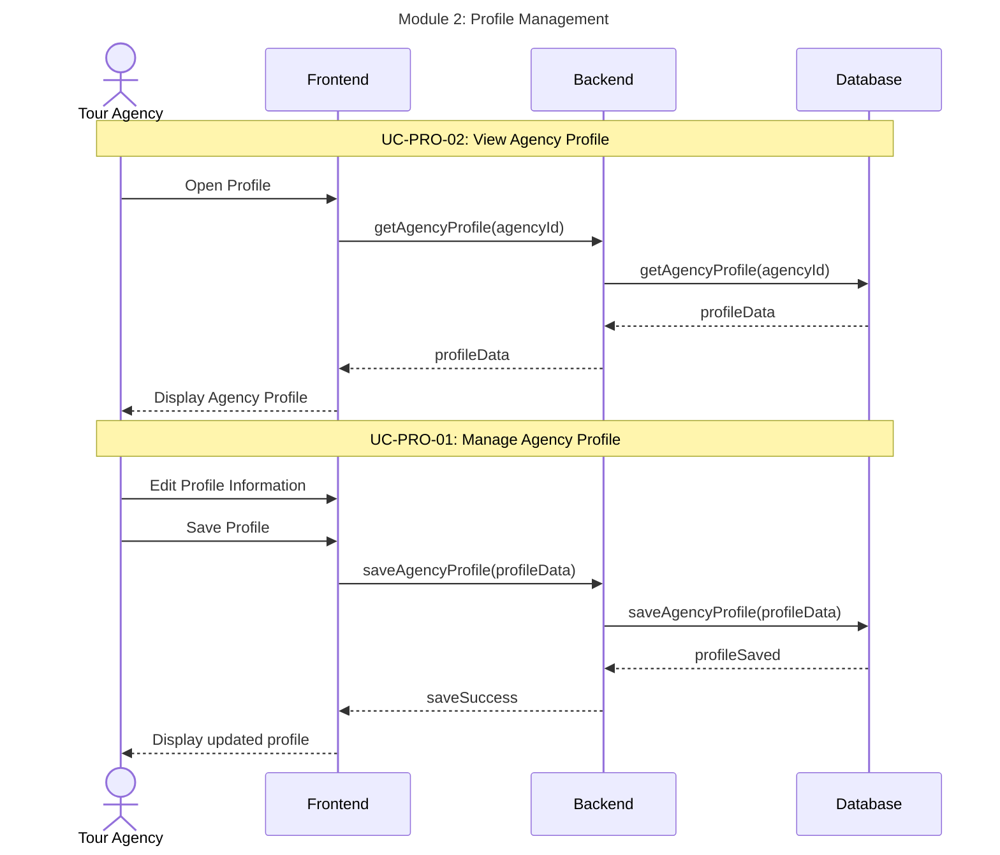
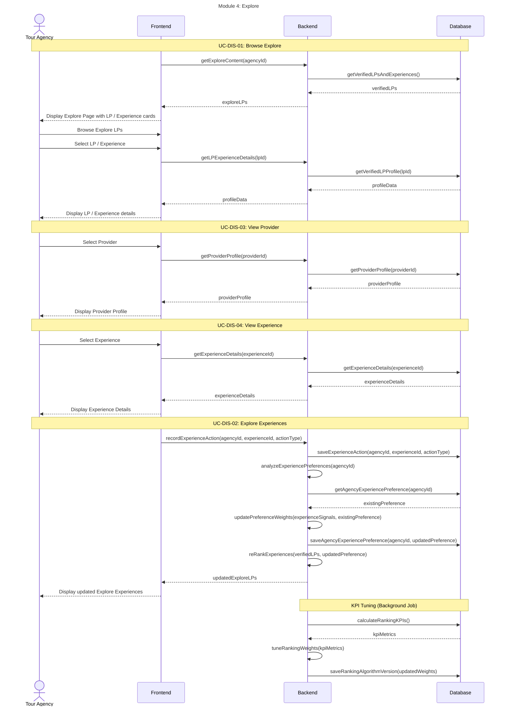
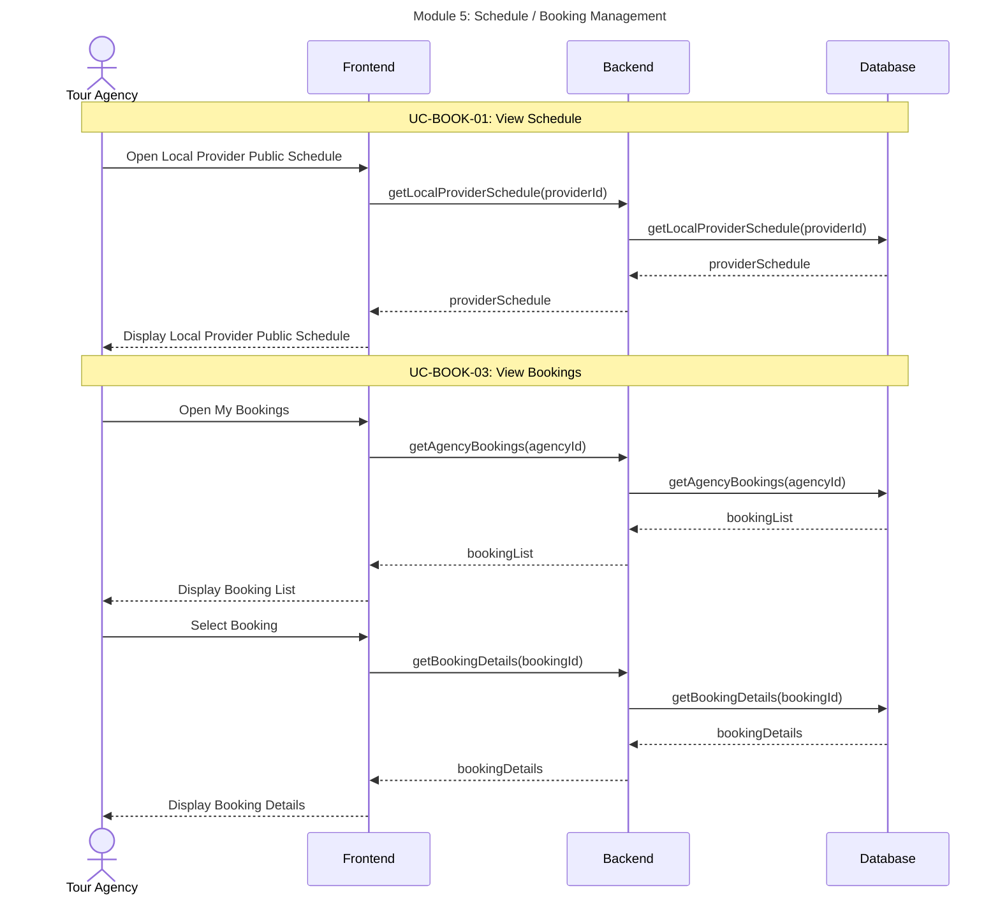
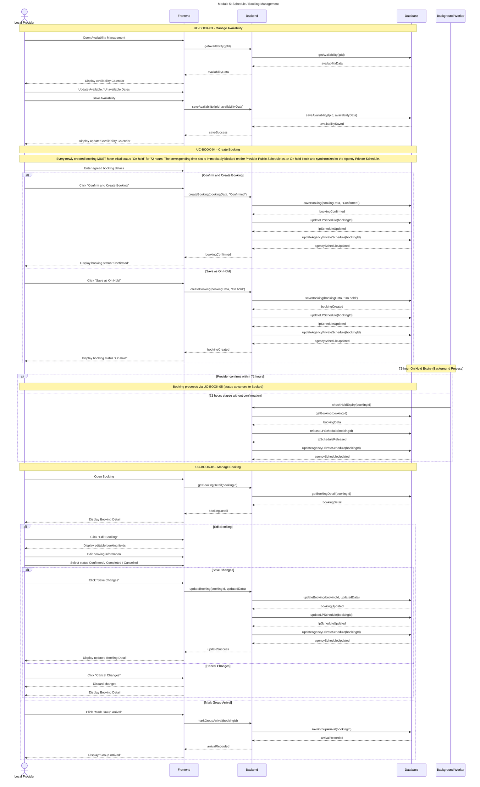
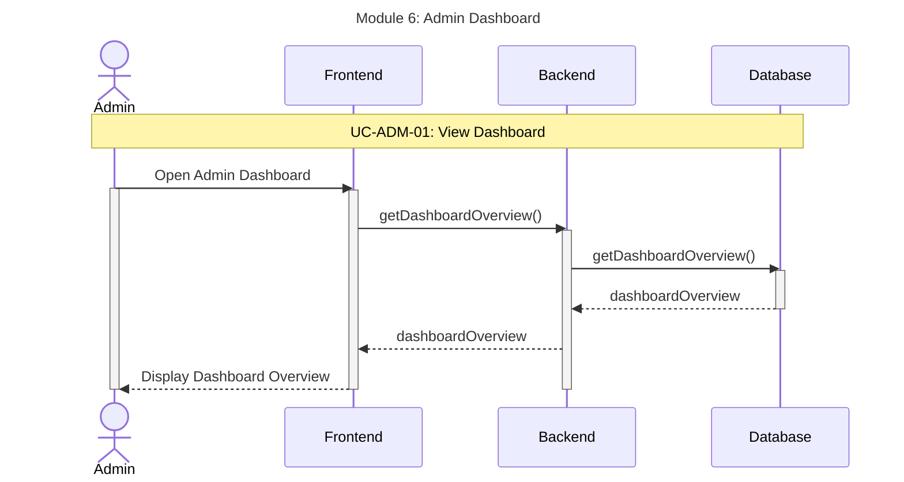
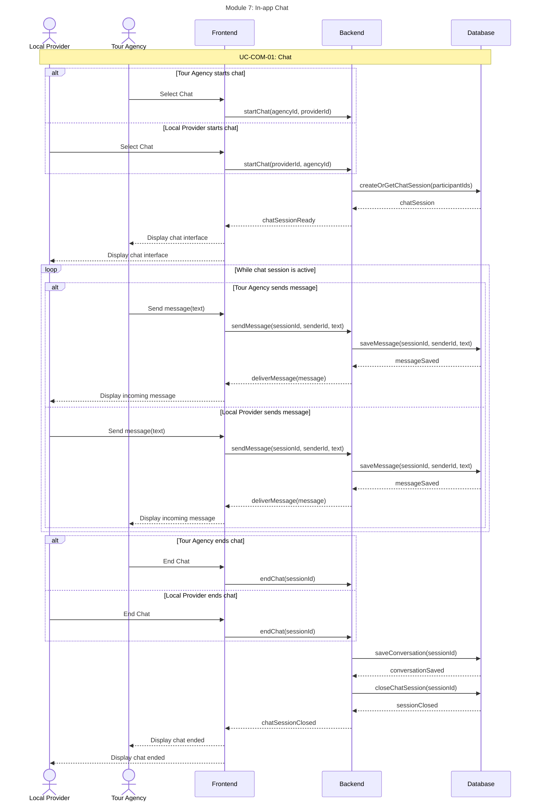

```mermaid
sequenceDiagram
    title Module 1: Authentication, Access & User Management
    actor LP
    participant Frontend
    participant Backend
    participant Database

    Note over LP, Database: UC-ACC-02: Log In
    LP->>Frontend: Enter login credentials
    activate Frontend
    Frontend->>Backend: login(credentials)
    activate Backend
    Backend->>Database: checkUserCredentials(credentials)
    activate Database
    Database-->>Backend: loginResult
    deactivate Database
    Backend->>Database: getRole(lpId)
    activate Database
    Database-->>Backend: role
    deactivate Database
    Backend-->>Frontend: loginSuccess("User")
    Frontend-->>LP: Display login status
    deactivate Backend
    deactivate Frontend

    Note over LP, Database: UC-ACC-03: Log Out
    LP->>Frontend: Select Logout
    activate Frontend
    Frontend->>Backend: logout()
    activate Backend
    Backend->>Backend: terminateSession()
    Backend-->>Frontend: logoutSuccess
    Frontend-->>LP: Display logout result
    deactivate Backend
    deactivate Frontend

    Note over LP, Database: UC-ACC-04: Forgot Password
    LP->>Frontend: Select "Forgot Password"
    activate Frontend
    Frontend-->>LP: Display password recovery form
    LP->>Frontend: Enter account email
    Frontend->>Backend: requestPasswordReset(email)
    activate Backend
    Backend->>Database: findUserByEmail(email)
    activate Database
    Database-->>Backend: userAccount
    deactivate Database
    Backend->>Backend: generateResetToken()
    Backend->>Database: saveResetToken(userId, resetToken)
    activate Database
    Database-->>Backend: tokenSaved
    deactivate Database
    Backend-->>Frontend: resetLinkGenerated
    Frontend-->>LP: Display password reset instructions
    deactivate Backend
    deactivate Frontend

    Note over LP, Database: UC-ACC-05: Change Password
    LP->>Frontend: Select "Change Password"
    activate Frontend
    Frontend-->>LP: Display change password form
    LP->>Frontend: Enter current password and new password
    Frontend->>Backend: changePassword(currentPassword, newPassword)
    activate Backend
    Backend->>Database: verifyCurrentPassword(lpId, currentPassword)
    activate Database
    Database-->>Backend: passwordVerified
    deactivate Database
    alt Current password is correct
        Backend->>Backend: hashNewPassword(newPassword)
        Backend->>Database: updatePassword(lpId, newPasswordHash)
        activate Database
        Database-->>Backend: passwordUpdated
        deactivate Database
        Backend-->>Frontend: changePasswordSuccess
        Frontend-->>LP: Display password changed successfully
    else Current password is incorrect
        Backend-->>Frontend: changePasswordFailed
        Frontend-->>LP: Display incorrect current password
    end
    deactivate Backend
    deactivate Frontend
```

```mermaid
sequenceDiagram
    title Module 1: Authentication, Access & User Management
    actor Agency as Tour Agency
    participant Frontend
    participant Backend
    participant Database

    Note over Agency, Database: UC-ACC-01: Register Account
    Agency->>Frontend: Enter account information
    activate Agency
    activate Frontend
    Frontend->>Backend: createAgencyAccount(accountData)
    activate Backend
    Backend->>Backend: validateAccountData()
    Backend->>Database: insertAgencyAccount(accountData, "Pending")
    activate Database
    Database-->>Backend: accountSaved
    deactivate Database
    Backend-->>Frontend: registrationPending
    Frontend-->>Agency: Display registration pending
    deactivate Backend
    deactivate Frontend
    deactivate Agency
```

```mermaid
sequenceDiagram
    title Module 1: Authentication, Access & User Management
    actor Admin
    participant Frontend
    participant Backend
    participant Database
    Note over Admin, Database: UC-ACC-07, UC-ACC-08: Create Account
    Admin->>Frontend: Enter LP account information
    activate Admin
    activate Frontend
    Frontend->>Backend: createLPAccount(accountData, villageId)
    activate Backend
    Backend->>Backend: validateAccountData()
    Backend->>Database: insertLPAccount(accountData, "User", villageId)
    activate Database
    Database-->>Backend: accountSaved
    deactivate Database
    Backend-->>Frontend: accountCreated
    Frontend-->>Admin: Display account created
    deactivate Backend
    deactivate Frontend
    deactivate Admin
    Note over Admin, Database: UC-ACC-06: Verify Agency
    Admin->>Frontend: Select Pending Account
    activate Admin
    activate Frontend
    Frontend->>Backend: getAccountDetails(accountId)
    activate Backend
    Backend->>Database: getAccountDetails(accountId)
    activate Database
    Database-->>Backend: accountDetails
    deactivate Database
    Backend-->>Frontend: accountDetails
    Frontend-->>Admin: Display Account Details
    deactivate Backend
    Admin->>Frontend: Click "Verify"
    Frontend->>Backend: verifyAccount(accountId)
    activate Backend
    Backend->>Database: updateAccountStatus(accountId, "Verified")
    activate Database
    Database-->>Backend: statusUpdated
    deactivate Database
    Backend-->>Frontend: verificationSuccess
    Frontend-->>Admin: Display account as "Verified"
    deactivate Backend
    deactivate Frontend
    deactivate Admin
    Note over Admin, Database: UC-ACC-09: Manage Accounts
    Admin->>Frontend: Toggle Enable / Disable
    Frontend->>Backend: updateAgencyStatus(agencyId, status)
    activate Backend
    Backend->>Database: updateAgencyStatus(agencyId, status)
    activate Database
    Database-->>Backend: statusUpdated
    deactivate Database
    Backend-->>Frontend: statusUpdateSuccess
    Frontend-->>Admin: Display updated account status
    deactivate Backend
```

```mermaid
sequenceDiagram
    title Module 2: Profile Management
    actor LP as Local Provider
    actor Admin
    participant Frontend
    participant Backend
    participant Database
    Note over LP, Database: UC-PRO-03 - View Local Provider Profile
    LP->>Frontend: Open Profile
    Frontend->>Backend: getProviderProfile(lpId)
    Backend->>Database: getProviderProfile(lpId)
    Database-->>Backend: profileData
    Backend-->>Frontend: profileData
    Frontend-->>LP: Display Provider Profile
    Note over LP, Database: UC-PRO-04 - Manage Provider Profile
    LP->>Frontend: Open Profile Management
    Frontend->>Backend: getProviderProfile(lpId)
    Backend->>Database: getProviderProfile(lpId)
    Database-->>Backend: profileData
    Backend-->>Frontend: profileData
    Frontend-->>LP: Display Provider Profile
    LP->>Frontend: Fill / Update Information
    LP->>Frontend: Enter / Edit Description
    opt AI Refinement
        LP->>Frontend: Click "AI Refinement"
        Frontend->>Backend: refineDescription(description)
        Backend->>Backend: generateRefinedDescription(description)
        Backend-->>Frontend: refinedDescription
        Frontend-->>LP: Display refined description
        LP->>Frontend: Accept / Edit refined description
    end
    LP->>Frontend: Save Profile
    Frontend->>Backend: saveProviderProfile(profileData, images)
    Backend->>Database: saveProviderProfile(profileData, images)
    Database-->>Backend: profileSaved
    Backend-->>Frontend: saveSuccess
    Frontend-->>LP: Display updated profile
    Note over LP, Database: UC-PRO-05 - Manage Experiences
    LP->>Frontend: Open Experience Management
    Frontend->>Backend: getExperiences(lpId)
    Backend->>Database: getExperiences(lpId)
    Database-->>Backend: experiences
    Backend-->>Frontend: experiences
    Frontend-->>LP: Display Experiences
    LP->>Frontend: Create / Edit Experience
    LP->>Frontend: Enter / Edit Experience Description
    opt AI Refinement
        LP->>Frontend: Click "AI Refinement"
        Frontend->>Backend: refineExperienceDescription(description)
        Backend->>Backend: generateRefinedDescription(description)
        Backend-->>Frontend: refinedDescription
        Frontend-->>LP: Display refined description
        LP->>Frontend: Accept / Edit refined description
    end
    LP->>Frontend: Save Experience
    Frontend->>Backend: saveExperience(experienceData, images)
    Backend->>Database: saveExperience(experienceData, images)
    Database-->>Backend: experienceSaved
    Backend-->>Frontend: saveSuccess
    Frontend-->>LP: Display updated Experience
    Note over Admin, Database: UC-PRO-06 - Verify Provider Profile
    Admin->>Frontend: Open Provider Profile for review
    Frontend->>Backend: getProviderProfile(providerId)
    Backend->>Database: getProviderProfile(providerId)
    Database-->>Backend: profileData
    Backend-->>Frontend: profileData
    Frontend-->>Admin: Display submitted Profile

    alt Approve
        Admin->>Frontend: Select "Approve"
        Frontend->>Backend: approveProviderProfile(providerId)
        Backend->>Database: updateProfileVerificationStatus(providerId, "Verified")
        Database-->>Backend: statusUpdated
        Backend-->>Frontend: approveSuccess
        Frontend-->>Admin: Display profile status "Verified"
    else Request Revision
        Admin->>Frontend: Select "Request Revision"
        Admin->>Frontend: Enter revision comments
        Frontend->>Backend: requestProfileRevision(providerId, comments)
        Backend->>Database: updateProfileVerificationStatus(providerId, "Revision Required")
        Backend->>Database: saveRevisionComments(providerId, comments)
        Database-->>Backend: statusUpdated
        Backend-->>Frontend: revisionRequested
        Frontend-->>Admin: Display profile status "Revision Required"
        Frontend-->>LP: Display revision comments
    end
```

```mermaid
sequenceDiagram
    title Module 2: Profile Management
    actor Agency as Tour Agency
    participant Frontend
    participant Backend
    participant Database

    Note over Agency, Database: UC-PRO-02: View Agency Profile
    Agency->>Frontend: Open Profile
    Frontend->>Backend: getAgencyProfile(agencyId)
    Backend->>Database: getAgencyProfile(agencyId)
    Database-->>Backend: profileData
    Backend-->>Frontend: profileData
    Frontend-->>Agency: Display Agency Profile

    Note over Agency, Database: UC-PRO-01: Manage Agency Profile
    Agency->>Frontend: Edit Profile Information
    Agency->>Frontend: Save Profile
    Frontend->>Backend: saveAgencyProfile(profileData)
    Backend->>Database: saveAgencyProfile(profileData)
    Database-->>Backend: profileSaved
    Backend-->>Frontend: saveSuccess
    Frontend-->>Agency: Display updated profile
```

```mermaid
sequenceDiagram
    title Module 3: AI Tour Matching
    actor Agency as Tour Agency
    participant Frontend
    participant Backend
    participant AIEngine as AI Matching Engine
    participant Database

    Note over Agency, Database: UC-DIS-05 - AI Tour Matching

    Note over Agency, Database: 1. Submit & Understand Tour Requirements
    Agency->>Frontend: Enter tour requirements in natural language
    activate Agency
    activate Frontend
    Frontend->>Backend: submitTourRequirements(requirements)
    activate Backend
    Backend->>AIEngine: analyzeRequirements(requirements)
    activate AIEngine
    AIEngine->>AIEngine: callOpenAI(requirements)

    alt OpenAI responds within timeout
        AIEngine->>AIEngine: parsedRequirements
        AIEngine->>AIEngine: Extract tour context
        AIEngine->>AIEngine: Extract constraints
        AIEngine->>AIEngine: Extract preferences
        AIEngine->>AIEngine: Infer semantic preferences
        AIEngine->>AIEngine: Check requirement completeness
    else OpenAI timeout or error
        AIEngine->>AIEngine: timeoutError
        AIEngine->>AIEngine: Fallback to rule-based requirement extraction
        AIEngine->>AIEngine: Extract tour context rule-based
        AIEngine->>AIEngine: Extract constraints rule-based
        AIEngine->>AIEngine: Check requirement completeness
        AIEngine-->>Backend: fallbackModeActive
        Backend-->>Frontend: fallbackModeActive
        Frontend-->>Agency: Display using simplified matching
    end

    Note over Agency, Database: 2. Clarify Missing Requirements or 3. AI Matching and Recommendation
    alt Requirements are incomplete
        AIEngine->>AIEngine: Identify missing critical criteria
        AIEngine->>AIEngine: Generate contextual follow-up question
        AIEngine-->>Backend: followUpQuestion
        Backend-->>Frontend: followUpQuestion
        Frontend-->>Agency: Display follow-up question
        Agency->>Frontend: Provide clarification
        Frontend->>Backend: submitClarification(response)
        Backend->>AIEngine: updateConversationContext(response)
        AIEngine->>AIEngine: Re-analyze requirements
        AIEngine->>AIEngine: Check requirement completeness
    else Requirements are complete
        Note over Backend, Database: 3. AI Matching and Recommendation
        Backend->>AIEngine: findVerifiedLPsAndExperiences(tourPreferenceProfile)
        AIEngine->>Database: getVerifiedLPAndExperiences(tourPreferenceProfile)
        Database-->>AIEngine: candidateLPsAndExperiences
        AIEngine->>AIEngine: Check hard constraints
        AIEngine->>AIEngine: Evaluate preferences
        AIEngine->>AIEngine: Evaluate route and distance

        alt AI ranking available
            AIEngine->>AIEngine: refineRanking(candidateLPsAndExperiences, tourPreferenceProfile)
            alt OpenAI responds within timeout
                AIEngine->>AIEngine: refinedScoresAndExplanations
                AIEngine->>AIEngine: Calculate match scores
                AIEngine->>AIEngine: Rank candidates
                AIEngine->>AIEngine: Generate match explanations
            else OpenAI timeout or error
                AIEngine->>AIEngine: timeoutError
                AIEngine->>AIEngine: Fallback to rule-based scoring
                AIEngine->>AIEngine: Calculate match scores rule-based weights
                AIEngine->>AIEngine: Rank candidates
                AIEngine->>AIEngine: Generate generic match explanations rule-based
                AIEngine-->>Backend: fallbackModeActive
                Backend-->>Frontend: fallbackModeActive
            end
        end

        AIEngine-->>Backend: rankedRecommendations
        Backend-->>Frontend: rankedRecommendations
        Frontend-->>Agency: Display ranked LP or Experience with match score and reasons
        opt Fallback mode was used
            Frontend-->>Agency: Display results based on simplified matching
        end
    end

    Note over Agency, Database: 4. Record Agency Preference Signals
    loop During Matching Session
        Agency->>Frontend: View or Request Quote or Chat or Book or Schedule
        Frontend->>Backend: recordPreferenceSignal(signal)
        Backend->>Database: savePreferenceSignal(agencyId, sessionId, signal)
        Database-->>Backend: signalSaved
    end

    Note over Agency, Database: 5. Analyze Preference Signals
    Backend->>Database: getCurrentSessionSignals(agencyId, sessionId)
    Database-->>Backend: currentSessionSignals
    Backend->>AIEngine: analyzePreferenceSignals(currentSessionSignals)
    AIEngine->>AIEngine: Identify common factors among interacted items
    AIEngine->>AIEngine: Identify recurring preference patterns
    AIEngine->>AIEngine: Infer related preferences from non-interacted items

    Note over Agency, Database: 6. Detect Session End
    alt Agency closes AI matching chat
        Frontend->>Backend: closeMatchingSession(sessionId)
    else 30-minute inactivity timeout
        Backend->>Backend: detectSessionTimeout(sessionId)
    end

    Note over Agency, Database: 7. Create Tour Preference Profile
    AIEngine->>AIEngine: Map semantic requirements
    AIEngine->>AIEngine: Assign preference weights
    AIEngine->>AIEngine: Generate Tour Preference Profile
    AIEngine-->>Backend: tourPreferenceProfile
    Backend-->>Frontend: tourPreferenceProfile
```

```mermaid
sequenceDiagram
    title Module 4: Explore
    actor Agency as Tour Agency
    participant Frontend
    participant Backend
    participant Database

    Note over Agency, Database: UC-DIS-01: Browse Explore
    Frontend->>Backend: getExploreContent(agencyId)
    Backend->>Database: getVerifiedLPsAndExperiences()
    Database-->>Backend: verifiedLPs
    Backend-->>Frontend: exploreLPs
    Frontend-->>Agency: Display Explore Page with LP / Experience cards

    Agency->>Frontend: Browse Explore LPs
    Agency->>Frontend: Select LP / Experience
    Frontend->>Backend: getLPExperienceDetails(lpId)
    Backend->>Database: getVerifiedLPProfile(lpId)
    Database-->>Backend: profileData
    Backend-->>Frontend: profileData
    Frontend-->>Agency: Display LP / Experience details

    Note over Agency, Database: UC-DIS-03: View Provider
    Agency->>Frontend: Select Provider
    Frontend->>Backend: getProviderProfile(providerId)
    Backend->>Database: getProviderProfile(providerId)
    Database-->>Backend: providerProfile
    Backend-->>Frontend: providerProfile
    Frontend-->>Agency: Display Provider Profile

    Note over Agency, Database: UC-DIS-04: View Experience
    Agency->>Frontend: Select Experience
    Frontend->>Backend: getExperienceDetails(experienceId)
    Backend->>Database: getExperienceDetails(experienceId)
    Database-->>Backend: experienceDetails
    Backend-->>Frontend: experienceDetails
    Frontend-->>Agency: Display Experience Details

    Note over Agency, Database: UC-DIS-02: Explore Experiences
    Frontend->>Backend: recordExperienceAction(agencyId, experienceId, actionType)
    Backend->>Database: saveExperienceAction(agencyId, experienceId, actionType)
    Backend->>Backend: analyzeExperiencePreferences(agencyId)
    Backend->>Database: getAgencyExperiencePreference(agencyId)
    Database-->>Backend: existingPreference
    Backend->>Backend: updatePreferenceWeights(experienceSignals, existingPreference)
    Backend->>Database: saveAgencyExperiencePreference(agencyId, updatedPreference)
    Backend->>Backend: reRankExperiences(verifiedLPs, updatedPreference)
    Backend-->>Frontend: updatedExploreLPs
    Frontend-->>Agency: Display updated Explore Experiences

    Note over Backend, Database: KPI Tuning (Background Job)
    Backend->>Database: calculateRankingKPIs()
    Database-->>Backend: kpiMetrics
    Backend->>Backend: tuneRankingWeights(kpiMetrics)
    Backend->>Database: saveRankingAlgorithmVersion(updatedWeights)
```

```mermaid
sequenceDiagram
    title Module 5: Schedule / Booking Management
    actor Agency as Tour Agency
    participant Frontend
    participant Backend
    participant Database

    Note over Agency, Database: UC-BOOK-01: View Schedule
    Agency->>Frontend: Open Local Provider Public Schedule
    Frontend->>Backend: getLocalProviderSchedule(providerId)
    Backend->>Database: getLocalProviderSchedule(providerId)
    Database-->>Backend: providerSchedule
    Backend-->>Frontend: providerSchedule
    Frontend-->>Agency: Display Local Provider Public Schedule

    Note over Agency, Database: UC-BOOK-03: View Bookings
    Agency->>Frontend: Open My Bookings
    Frontend->>Backend: getAgencyBookings(agencyId)
    Backend->>Database: getAgencyBookings(agencyId)
    Database-->>Backend: bookingList
    Backend-->>Frontend: bookingList
    Frontend-->>Agency: Display Booking List

    Agency->>Frontend: Select Booking
    Frontend->>Backend: getBookingDetails(bookingId)
    Backend->>Database: getBookingDetails(bookingId)
    Database-->>Backend: bookingDetails
    Backend-->>Frontend: bookingDetails
    Frontend-->>Agency: Display Booking Details
```

```mermaid
sequenceDiagram
    title Module 5: Schedule / Booking Management
    actor LP as Local Provider
    participant Frontend
    participant Backend
    participant Database
    participant Worker as Background Worker

    Note over LP, Database: UC-BOOK-03 - Manage Availability
    LP->>Frontend: Open Availability Management
    Frontend->>Backend: getAvailability(lpId)
    Backend->>Database: getAvailability(lpId)
    Database-->>Backend: availabilityData
    Backend-->>Frontend: availabilityData
    Frontend-->>LP: Display Availability Calendar

    LP->>Frontend: Update Available / Unavailable Dates
    LP->>Frontend: Save Availability
    Frontend->>Backend: saveAvailability(lpId, availabilityData)
    Backend->>Database: saveAvailability(lpId, availabilityData)
    Database-->>Backend: availabilitySaved
    Backend-->>Frontend: saveSuccess
    Frontend-->>LP: Display updated Availability Calendar

    Note over LP, Database: UC-BOOK-04 - Create Booking
    Note over LP, Database: Every newly created booking MUST have initial status "On hold" for 72 hours. The corresponding time slot is immediately blocked on the Provider Public Schedule as an On hold block and synchronized to the Agency Private Schedule.
    LP->>Frontend: Enter agreed booking details

    alt Confirm and Create Booking
        LP->>Frontend: Click "Confirm and Create Booking"
        Frontend->>Backend: createBooking(bookingData, "Confirmed")
        Backend->>Database: saveBooking(bookingData, "Confirmed")
        Database-->>Backend: bookingConfirmed
        Backend->>Database: updateLPSchedule(bookingId)
        Database-->>Backend: lpScheduleUpdated
        Backend->>Database: updateAgencyPrivateSchedule(bookingId)
        Database-->>Backend: agencyScheduleUpdated
        Backend-->>Frontend: bookingConfirmed
        Frontend-->>LP: Display booking status "Confirmed"
    else Save as On Hold
        LP->>Frontend: Click "Save as On Hold"
        Frontend->>Backend: createBooking(bookingData, "On hold")
        Backend->>Database: saveBooking(bookingData, "On hold")
        Database-->>Backend: bookingCreated
        Backend->>Database: updateLPSchedule(bookingId)
        Database-->>Backend: lpScheduleUpdated
        Backend->>Database: updateAgencyPrivateSchedule(bookingId)
        Database-->>Backend: agencyScheduleUpdated
        Backend-->>Frontend: bookingCreated
        Frontend-->>LP: Display booking status "On hold"
    end

    Note over Worker, Database: 72-hour On Hold Expiry (Background Process)
    alt Provider confirms within 72 hours
        Note over LP, Database: Booking proceeds via UC-BOOK-05 (status advances to Booked)
    else 72 hours elapse without confirmation
        Worker->>Backend: checkHoldExpiry(bookingId)
        Backend->>Database: getBooking(bookingId)
        Database-->>Backend: bookingData
        Backend->>Database: releaseLPSchedule(bookingId)
        Database-->>Backend: lpScheduleReleased
        Backend->>Database: updateAgencyPrivateSchedule(bookingId)
        Database-->>Backend: agencyScheduleUpdated
    end

    Note over LP, Database: UC-BOOK-05 - Manage Booking
    LP->>Frontend: Open Booking
    Frontend->>Backend: getBookingDetail(bookingId)
    Backend->>Database: getBookingDetail(bookingId)
    Database-->>Backend: bookingDetail
    Backend-->>Frontend: bookingDetail
    Frontend-->>LP: Display Booking Detail

    alt Edit Booking
        LP->>Frontend: Click "Edit Booking"
        Frontend-->>LP: Display editable booking fields
        LP->>Frontend: Edit booking information
        LP->>Frontend: Select status Confirmed / Completed / Cancelled

        alt Save Changes
            LP->>Frontend: Click "Save Changes"
            Frontend->>Backend: updateBooking(bookingId, updatedData)
            Backend->>Database: updateBooking(bookingId, updatedData)
            Database-->>Backend: bookingUpdated
            Backend->>Database: updateLPSchedule(bookingId)
            Database-->>Backend: lpScheduleUpdated
            Backend->>Database: updateAgencyPrivateSchedule(bookingId)
            Database-->>Backend: agencyScheduleUpdated
            Backend-->>Frontend: updateSuccess
            Frontend-->>LP: Display updated Booking Detail
        else Cancel Changes
            LP->>Frontend: Click "Cancel Changes"
            Frontend-->>LP: Discard changes
            Frontend-->>LP: Display Booking Detail
        end
    else Mark Group Arrival
        LP->>Frontend: Click "Mark Group Arrival"
        Frontend->>Backend: markGroupArrival(bookingId)
        Backend->>Database: saveGroupArrival(bookingId)
        Database-->>Backend: arrivalRecorded
        Backend-->>Frontend: arrivalRecorded
        Frontend-->>LP: Display "Group Arrived"
    end
```

```mermaid
sequenceDiagram
    title Module 6: Admin Dashboard
    actor Admin
    participant Frontend
    participant Backend
    participant Database

    Note over Admin, Database: UC-ADM-01: View Dashboard
    Admin->>Frontend: Open Admin Dashboard
    activate Admin
    activate Frontend
    Frontend->>Backend: getDashboardOverview()
    activate Backend
    Backend->>Database: getDashboardOverview()
    activate Database
    Database-->>Backend: dashboardOverview
    deactivate Database
    Backend-->>Frontend: dashboardOverview
    Frontend-->>Admin: Display Dashboard Overview
    deactivate Backend
    deactivate Frontend
    deactivate Admin
```

```mermaid
sequenceDiagram
    title Module 7: In-app Chat
    actor Provider as Local Provider
    actor Agency as Tour Agency
    participant Frontend
    participant Backend
    participant Database

    Note over Provider, Database: UC-COM-01: Chat
    alt Tour Agency starts chat
        Agency->>Frontend: Select Chat
        Frontend->>Backend: startChat(agencyId, providerId)
    else Local Provider starts chat
        Provider->>Frontend: Select Chat
        Frontend->>Backend: startChat(providerId, agencyId)
    end

    Backend->>Database: createOrGetChatSession(participantIds)
    Database-->>Backend: chatSession
    Backend-->>Frontend: chatSessionReady
    Frontend-->>Agency: Display chat interface
    Frontend-->>Provider: Display chat interface

    loop While chat session is active
        alt Tour Agency sends message
            Agency->>Frontend: Send message(text)
            Frontend->>Backend: sendMessage(sessionId, senderId, text)
            Backend->>Database: saveMessage(sessionId, senderId, text)
            Database-->>Backend: messageSaved
            Backend-->>Frontend: deliverMessage(message)
            Frontend-->>Provider: Display incoming message
        else Local Provider sends message
            Provider->>Frontend: Send message(text)
            Frontend->>Backend: sendMessage(sessionId, senderId, text)
            Backend->>Database: saveMessage(sessionId, senderId, text)
            Database-->>Backend: messageSaved
            Backend-->>Frontend: deliverMessage(message)
            Frontend-->>Agency: Display incoming message
        end
    end

    alt Tour Agency ends chat
        Agency->>Frontend: End Chat
        Frontend->>Backend: endChat(sessionId)
    else Local Provider ends chat
        Provider->>Frontend: End Chat
        Frontend->>Backend: endChat(sessionId)
    end

    Backend->>Database: saveConversation(sessionId)
    Database-->>Backend: conversationSaved
    Backend->>Database: closeChatSession(sessionId)
    Database-->>Backend: sessionClosed
    Backend-->>Frontend: chatSessionClosed
    Frontend-->>Agency: Display chat ended
    Frontend-->>Provider: Display chat ended
```
