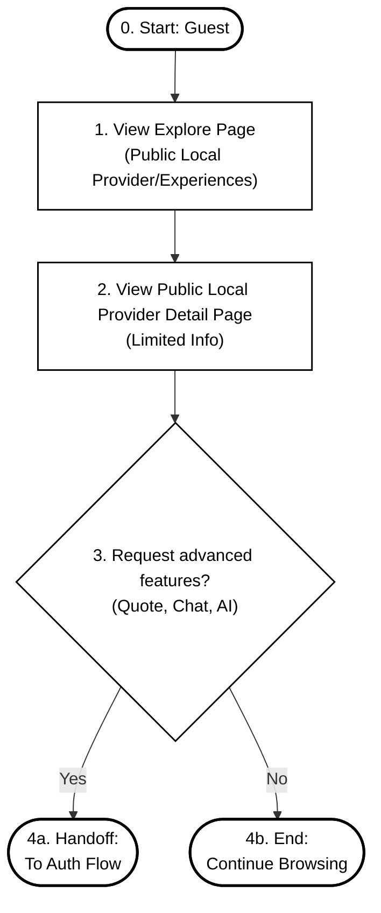
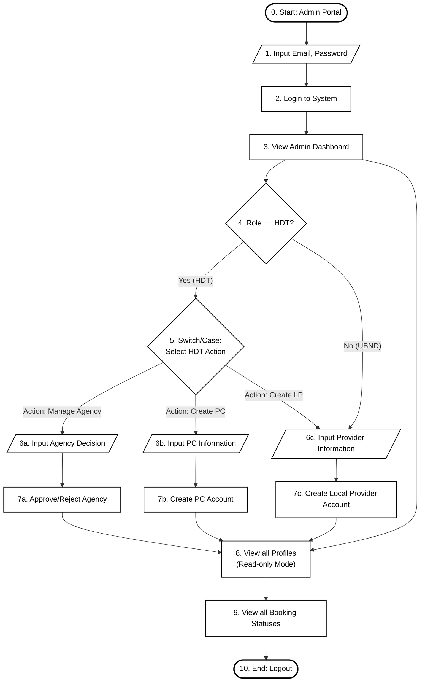
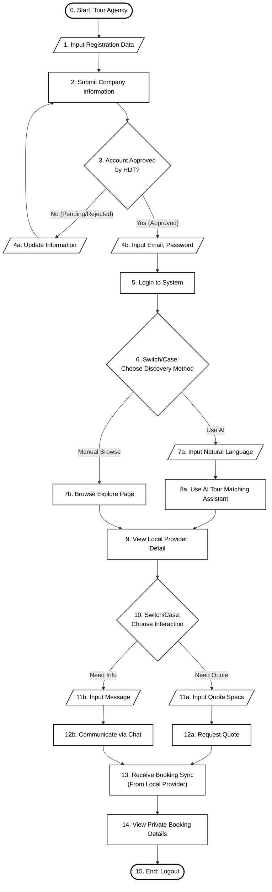
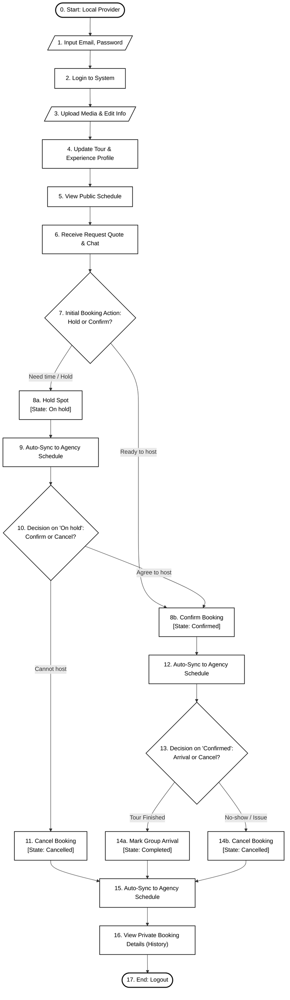

# Usage Flow

## 1. Guest Flow

```mermaid
graph TD
  classDef default fill:#FFFFFF,stroke:#000000,stroke-width:1.5px,color:#000000;
  classDef startend fill:#FFFFFF,stroke:#000000,stroke-width:2.5px,color:#000000;
  G_Start(["0. Start: Guest"])
  G1["1. View Explore Page\n(Public Local Provider/Experiences)"]
  G2["2. View Public Local Provider Detail Page\n(Limited Info)"]
  %% Binary Decision
  G3{"3. Request advanced features?\n(Quote, Chat, AI)"}
  G_Handoff(["4a. Handoff:\nTo Auth Flow"])
  G_End(["4b. End:\nContinue Browsing"])
  G_Start --> G1
  G1 --> G2
  G2 --> G3
  G3 -- "Yes" --> G_Handoff
  G3 -- "No" --> G_End
  class G_Start,G_Handoff,G_End startend;
```

## 2. Admin Flow

```mermaid
graph TD
  classDef default fill:#FFFFFF,stroke:#000000,stroke-width:1.5px,color:#000000;
  classDef startend fill:#FFFFFF,stroke:#000000,stroke-width:2.5px,color:#000000;
  A_Start(["0. Start: Admin Portal"])
  A1[/"1. Input Email, Password"/]
  A2["2. Login to System"]
  A3["3. View Admin Dashboard"]
  %% Binary Decision for Role
  A4{"4. Role == HDT?"}
  %% Switch/Case for HDT Actions
  A5{"5. Switch/Case:\nSelect HDT Action"}
  A6[/"6a. Input Agency Decision"/]
  A7["7a. Approve/Reject Agency"]
  A8[/"6b. Input PC Information"/]
  A9["7b. Create PC Account"]
  A10[/"6c. Input Provider Information"/]
  A11["7c. Create Local Provider Account"]
  A12["8. View all Profiles\n(Read-only Mode)"]
  A13["9. View all Booking Statuses"]
  A_End(["10. End: Logout"])
  A_Start --> A1 --> A2 --> A3 --> A4
  %% HDT Branch
  A4 -- "Yes (HDT)" --> A5
  A5 -- "Action: Manage Agency" --> A6 --> A7
  A5 -- "Action: Create PC" --> A8 --> A9
  A5 -- "Action: Create LP" --> A10 --> A11
  %% UBND Branch
  A4 -- "No (UBND)" --> A10
  %% Convergence
  A7 --> A12
  A9 --> A12
  A11 --> A12
  A3 --> A12 --> A13 --> A_End
  class A_Start,A_End startend;
```

## 3. Tour Agency Flow

```mermaid
graph TD
  classDef default fill:#FFFFFF,stroke:#000000,stroke-width:1.5px,color:#000000;
  classDef startend fill:#FFFFFF,stroke:#000000,stroke-width:2.5px,color:#000000;
  TA_Start(["0. Start: Tour Agency"])
  TA1[/"1. Input Registration Data"/]
  TA2["2. Submit Company Information"]
  %% Binary Decision
  TA3{"3. Account Approved\nby HDT?"}
  TA4[/"4a. Update Information"/]
  TA5[/"4b. Input Email, Password"/]
  TA6["5. Login to System"]
  %% Switch/Case Decision
  TA7{"6. Switch/Case:\nChoose Discovery Method"}
  TA8[/"7a. Input Natural Language"/]
  TA9["8a. Use AI Tour Matching Assistant"]
  TA10["7b. Browse Explore Page"]
  TA11["9. View Local Provider Detail"]
  %% Switch/Case Decision
  TA12{"10. Switch/Case:\nChoose Interaction"}
  TA13[/"11a. Input Quote Specs"/]
  TA14["12a. Request Quote"]
  TA15[/"11b. Input Message"/]
  TA16["12b. Communicate via Chat"]
  TA17["13. Receive Booking Sync\n(From Local Provider)"]
  TA18["14. View Private Booking Details"]
  TA_End(["15. End: Logout"])
  TA_Start --> TA1 --> TA2 --> TA3
  TA3 -- "No (Pending/Rejected)" --> TA4 --> TA2
  TA3 -- "Yes (Approved)" --> TA5 --> TA6 --> TA7
  TA7 -- "Use AI" --> TA8 --> TA9 --> TA11
  TA7 -- "Manual Browse" --> TA10 --> TA11
  TA11 --> TA12
  TA12 -- "Need Quote" --> TA13 --> TA14 --> TA17
  TA12 -- "Need Info" --> TA15 --> TA16 --> TA17
  TA17 --> TA18 --> TA_End
  class TA_Start,TA_End startend;
```

## 4. Local Provider Flow

```mermaid
graph TD
  classDef default fill:#FFFFFF,stroke:#000000,stroke-width:1.5px,color:#000000;
  classDef startend fill:#FFFFFF,stroke:#000000,stroke-width:2.5px,color:#000000;
  classDef decision fill:#FFFFFF,stroke:#000000,stroke-width:1.5px,color:#000000;
  LP_Start(["0. Start: Local Provider"])
  LP1[/"1. Input Email, Password"/]
  LP2["2. Login to System"]
  LP3[/"3. Upload Media & Edit Info"/]
  LP4["4. Update Tour & Experience Profile"]
  LP5["5. View Public Schedule"]
  LP6["6. Receive Request Quote & Chat"]
  %% --- PHASE 1: INITIALIZE BOOKING ---
  LP7{"7. Initial Booking Action:\nHold or Confirm?"}
  LP8["8a. Hold Spot\n[State: On hold]"]
  LP9["8b. Confirm Booking \n[State: Confirmed]"]
  %% --- PHASE 2: MANAGE 'ON HOLD' STATE ---
  LP_Sync1["9. Auto-Sync to Agency Schedule"]
  LP10{"10. Decision on 'On hold':\nConfirm or Cancel?"}
  LP11["11. Cancel Booking\n[State: Cancelled]"]
  %% --- PHASE 3: MANAGE 'BOOKED' STATE ---
  LP_Sync2["12. Auto-Sync to Agency Schedule"]
  LP12{"13. Decision on 'Confirmed':\nArrival or Cancel?"}
  LP13["14a. Mark Group Arrival\n[State: Completed]"]
  LP14["14b. Cancel Booking\n[State: Cancelled]"]
  %% --- PHASE 4: TERMINAL STATES & HISTORY ---
  LP_Sync3["15. Auto-Sync to Agency Schedule"]
  LP15["16. View Private Booking Details (History)"]
  LP_End(["17. End: Logout"])
  %% --- FLOW CONNECTIONS ---
  LP_Start --> LP1 --> LP2 --> LP3 --> LP4 --> LP5 --> LP6 --> LP7
  %% Initial Creation Routing
  LP7 -- "Need time / Hold" --> LP8
  LP7 -- "Ready to host" --> LP9
  %% On Hold Flow
  LP8 --> LP_Sync1 --> LP10
  LP10 -- "Agree to host" --> LP9
  LP10 -- "Cannot host" --> LP11
  %% Booked Flow
  LP9 --> LP_Sync2 --> LP12
  LP12 -- "Tour Finished" --> LP13
  LP12 -- "No-show / Issue" --> LP14
  %% Routing Terminal States to Final Sync & History
  LP11 --> LP_Sync3
  LP13 --> LP_Sync3
  LP14 --> LP_Sync3
  LP_Sync3 --> LP15 --> LP_End
  %% Assign classes
  class LP_Start,LP_End startend;
  class LP7,LP10,LP12 decision;
```
